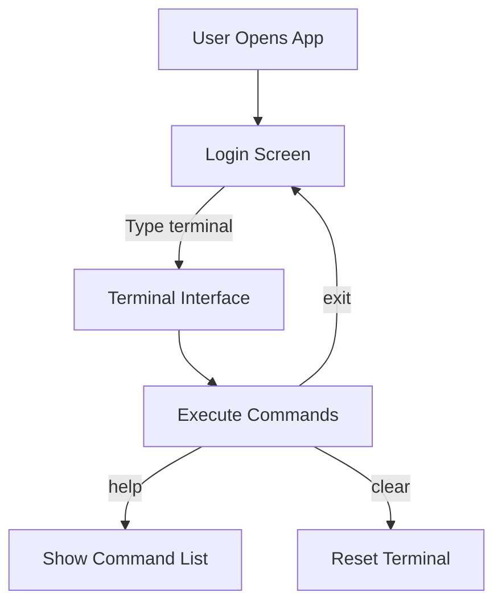

# 🚀 OS Project Terminal Demo v1  
**A Hyper-Realistic Terminal Simulator — Pure Frontend Magic**

<div align="center">
  
  <br/><br/>
 <a href="https://aaryanbanskota.github.io/os-project-terminal-demo-v1/" target="_blank" rel="noopener noreferrer">
    
</div>

---

## 📊 System Flow Diagram



---

## 🌟 Key Features

### 🖥️ Immersive CLI Experience
```bash
user@os-demo:~$ ping google.com
PING google.com (142.250.190.46) 56(84) bytes of data.
64 bytes from del03s08-in-f14.1e100.net: icmp_seq=1 ttl=117 time=12.3ms
```
- **Fully simulated outputs**
- **No system risk — 100% frontend**
- **Commands supported:** `help`, `clear`, `ipconfig`, `ping`, `dir`, `exit` (all dummy logic)

### 🧩 Modular & Lightweight
- Built with vanilla HTML, CSS, and JS
- Zero dependencies, zero backend
- Works offline in any modern browser

---

## 🛠️ Tech Architecture

<div align="center">
  
</div>


---

## 🎮 Try It Yourself

```bash
# Clone and run locally
git clone https://github.com/Aaryanbanskota/os-project-terminal-demo-v1
cd os-project-terminal-demo-v1
open index.html  # or just double-click to open in browser
```

---

## 📸 Screenshot Gallery

| Login Screen | Terminal View |
|--------------|----------------|
|  |  |

---

## 🙌 Credits

Crafted with ❤️ by **Aaryan Banskota** as part of an academic OS simulation demo.  
Feedback and ideas are always welcome!

---

> “CLI isn’t dead — it just moved to the browser.”
